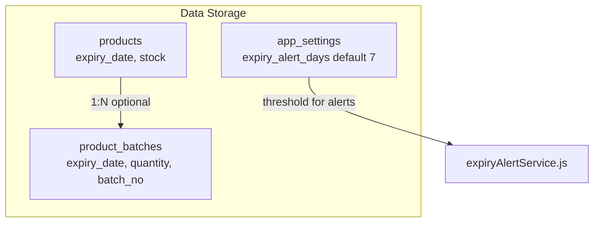
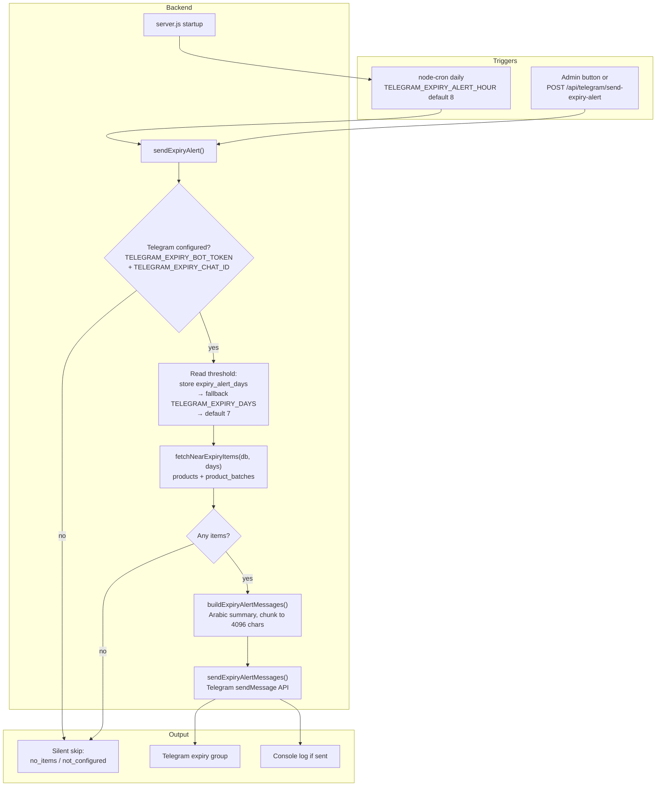
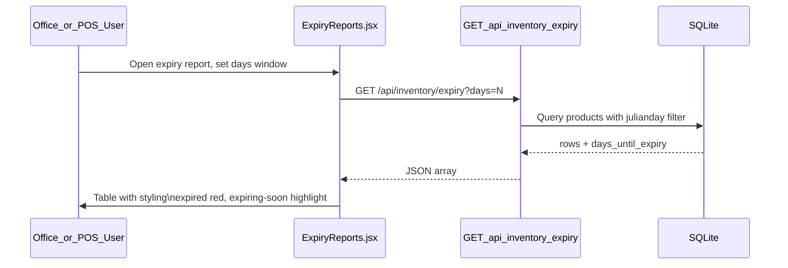
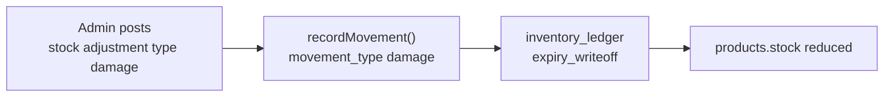
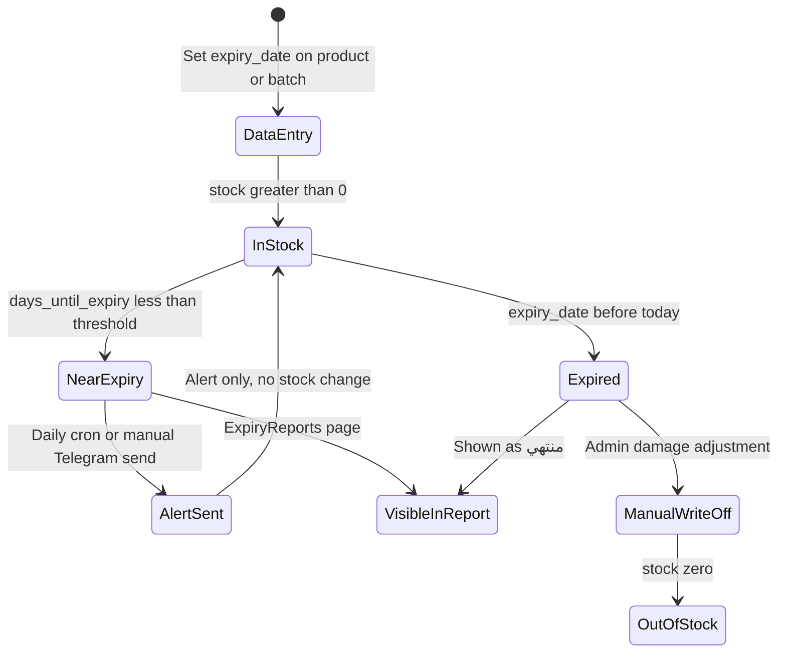

# Expiration Process — How It Works

## Summary

In this codebase, **expiration is a monitoring and alerting system**, not an automatic disposal pipeline. The system:

- Stores `expiry_date` on products (and optionally on `product_batches`)
- Computes **days until expiry** with SQLite `julianday()`
- Shows **expiry reports** in the office and POS UIs
- Sends **daily Telegram alerts** for items nearing expiry (plus manual send from store settings)
- Allows **manual stock write-off** via inventory adjustment type `damage` → ledger type `expiry_writeoff`

It does **not** automatically remove expired stock, block checkout for expired products, or deduct `product_batches` on sale.

---

## 1. Data Model

Two places hold expiry information:

| Layer | Table / field | Purpose |
|-------|---------------|---------|
| Product-level | `products.expiry_date` | Single expiry date per SKU (YYYY-MM-DD) |
| Batch-level | `product_batches` | Optional lots with their own `expiry_date`, `quantity`, `batch_no` |



**Key files:**

- Schema: `backend/database/init.js` — `expiry_date` column on `products`, `product_batches` table
- Product CRUD: `backend/routes/products.js` — set/update `expiry_date` on create/edit
- Batch CRUD: `backend/routes/inventory.js` — `GET/POST/DELETE /api/inventory/batches`

---

## 2. Expiry Query Logic (shared everywhere)

All expiry queries use the same SQLite pattern:

```sql
CAST(julianday(expiry_date) - julianday('now') AS INTEGER) AS days_until_expiry
```

**Inclusion rule for alerts** (`fetchNearExpiryItems` in `backend/services/expiryAlertService.js`):

- `expiry_date` is set and non-empty
- `stock > 0` (products) or `quantity > 0` (batches)
- Expires within **N days** (including already expired: `days_until_expiry` can be negative)

**Reports** (`GET /api/inventory/expiry` in `backend/routes/inventory.js`) use the same date window but only query `products` (not batches). Default window: 30 days (UI-configurable).

**Label formatting** (`formatDaysLabel` in `backend/utils/telegram.js`):

- Negative days → `منتهي (X يوم)` (already expired)
- Zero → `ينتهي اليوم`
- Positive → `X يوم`

---

## 3. Telegram Alert Flow (main “expiration process”)

This is the only **automated** expiration workflow.



**Configuration chain:**

1. **Disable entirely:** `DISABLE_EXPIRY_TELEGRAM_ALERT=1` in `.env.example`
2. **Alert hour:** `TELEGRAM_EXPIRY_ALERT_HOUR` (0–23, default 8) — scheduled in `backend/server.js`
3. **Days threshold:** `expiry_alert_days` in store settings (`frontend/src/pages/StoreSettings.jsx`) → persisted via `backend/utils/settings.js` → env fallback `TELEGRAM_EXPIRY_DAYS=7`
4. **Telegram bot:** separate expiry bot (`TELEGRAM_EXPIRY_BOT_TOKEN`, `TELEGRAM_EXPIRY_CHAT_ID`) — send-only, no approve/reject buttons

**Core service:** `backend/services/expiryAlertService.js`  
**Message builder/sender:** `backend/utils/telegram.js`  
**Manual API:** `backend/routes/telegram.js` — admin-only `POST /api/telegram/send-expiry-alert`

For Telegram setup steps, see also `REFUNDS_GUIDE.md` (expiry bot section).

---

## 4. Reporting Flow (UI)



**UI locations:**

- Office: `frontend/src/pages/ExpiryReports.jsx`
- POS: `frontend-pos/src/pages/ExpiryReports.jsx`

**Product dashboard** also shows expiry on a single product: `GET /api/products/:id/overview` in `backend/routes/products.js` returns `expiry.expiry_date` and `days_until_expiry`.

---

## 5. Manual Expired Stock Handling

When staff physically disposes of expired goods, they use **inventory adjustment type `damage`**:



Mapping in `backend/utils/inventory.js`: `damage` → ledger type `expiry_writeoff`.  
There is **no cron or automatic job** that creates these write-offs when `expiry_date` passes.

---

## 6. What Is NOT Part of Expiration

| Expected behavior | Status in codebase |
|-------------------|-------------------|
| Auto write-off at midnight when expired | Not implemented |
| Block POS sale of expired product | Not implemented |
| Deduct `product_batches` on checkout (FEFO) | Not implemented — batches are alert/report only |
| Expiry bot interactive commands | Not implemented — alerts are outbound only |

---

## 7. End-to-End Lifecycle (conceptual)



---

## Key Takeaway

The **expiration process** = **track dates → query with `julianday` → report in UI → notify via Telegram → optionally manual write-off**. Alerts inform staff; they do not change inventory. Operational response (discount, remove from shelf, write off) is manual outside the automated alert loop.
